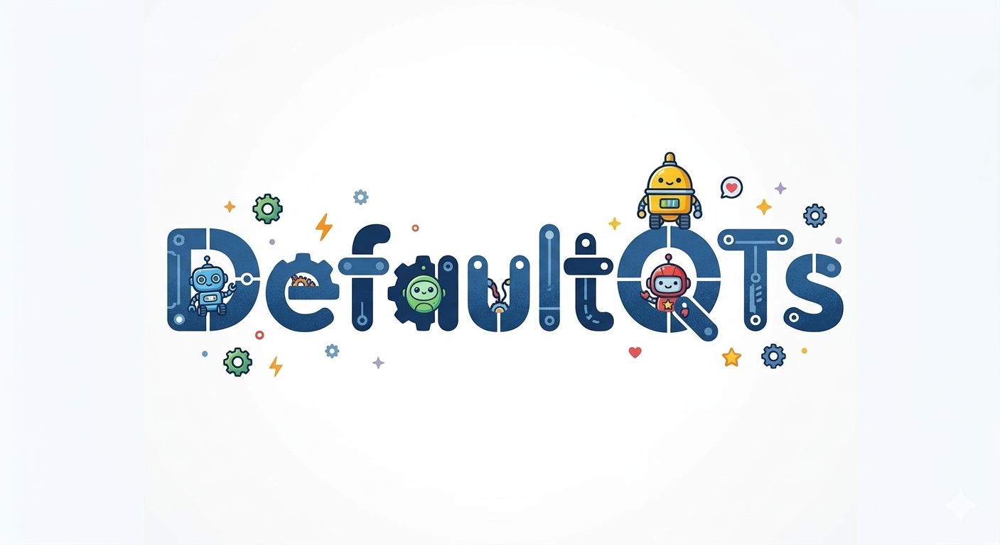

# CS732 project - Team Default QTs


# 🐣 GrowFriend - Grow Together!

**GrowFriend** is a full-stack gamified productivity application developed by **Defaul QTs**. It transforms the mundane nature of task management into an engaging journey of nurturing virtual pets. By completing personal tasks, participating in community quests, and utilizing a Pomodoro-style Focus Mode, users earn currency to evolve their digital companions through multiple life stages.

---

## 👥 The Team: DefaultQTs

- Musyafa Muhammad _(mmuh470@aucklanduni.ac.nz)_
- Aidil Muslim _(amus790@aucklanduni.ac.nz)_
- Manu R _(msri874@aucklanduni.ac.nz)_
- Yang Wu _(ywu329@aucklanduni.ac.nz)_
- Vincent Chen _(kche264@aucklanduni.ac.nz)_
- Tao Zhang _(tzha210@aucklanduni.ac.nz)_



---

## 🚀 Live Demo & Deployment

*   **Frontend:**  [](https://growfriend-project.vercel.app/)
*   **Backend API:**  [](https://growfriend-api.onrender.com/)

---

## 🛠 Technical Stack
GrowFriend is built using the **MERN** stack, emphasizing scalability, data integrity, and performance.

*   **Frontend:** React.js, Vite, Framer Motion (Animations), CSS Modules.
*   **Backend:** Node.js, Express.js.
*   **Database:** MongoDB Atlas (Primary Data), **Redis Cloud** (Experimental Caching).
*   **Authentication:** JSON Web Tokens (JWT) with Bcrypt password hashing.
*   **Testing:** Vitest (Frontend), Supertest (API), MongoMemoryReplSet (Database Integration).

---

## 🌟 Key Features

### 1. Pet Growth & Evolution System
*   **Lifecycle Stages:** Pets progress from **Egg ➔ Kid ➔ Adult**.
*   **Manual Evolution:** To ensure user engagement, evolution is not automatic. When a pet hits a level cap (Lvl 4 or Lvl 9), growth "freezes" until the user triggers a manual evolution event.
*   **Diversity:** Supports 6 distinct evolutionary line of fauna that are famous in Aotearoa New Zealand.

### 2. Triple-Tier Task Economy
*   **MyTask (Personal):** A private productivity area for individual goals.
*   **SystemTasks (Community):** Admin-generated organization and activity tasks.
*   **P2P Tasks (The Escrow System):** High-complexity peer-to-peer tasking. 
    *   **Escrow Security:** When a user creates a P2P task, coins are automatically locked in a `TaskEscrow` record to guarantee payment upon completion.
    *   **Dispute System:** A robust workflow allowing creators or assignees to raise disputes for admin review, ensuring fairness in the community marketplace.

### 3. Focus Mode (Pomodoro)
*   Integrates a 25-minute productivity timer.
*   **Real-time Progress:** The virtual pet visually moves across a progress track as the timer elapses.
*   **Economic Incentive:** Successful completion rewards users with 10 coins, directly integrated with the backend transaction ledger.

---

## 🧪 Technical Ambition & Tooling

### **Advanced Database Management**
We utilized **Mongoose Sessions and Transactions** for critical operations like store purchases and P2P task creation. This ensures atomicity: either the coins are deducted and the item is added, or neither happens, preventing data corruption or currency exploits.

### **Server-Side Optimization with Redis**
To demonstrate research into large-scale systems, we integrated **Redis Cloud**. 
*   **Cached Endpoints:** Dashboard Aggregation API, User Pets (Active), Store Items, and Inventory.
*   **Load Test Results:**
    - No cache (bare database): 837 requests, 1.16MB read
    - Local Docker Redis: 76k requests, 109MB read
    - Redis Cloud: 2k requests, 2.5MB read
*   **Impact:** Significant reduction in response latency and database load for heavy aggregation queries.

### **Robust Testing Environment**
Unlike standard prototypes, GrowFriend includes a professional-grade testing suite:
*   **Isolation:** Use of `mongodb-memory-server` to run a temporary database for every test run.
*   **Coverage:** Automated tests for the Escrow state machine, JWT middleware, and Pet growth logic.

---

## 📦 Installation & Setup (for Devs)

### Prerequisites
*   Node.js
*   MongoDB Atlas Account
*   Redis Server (Optional for local dev)

### 1. Clone the Repository
```bash
git clone https://github.com/UOA-CS732-S1-2026/group-project-default-qts.git
cd group-project-default-qts
```
### 2. Redis Setup (Local/Docker server)
1. Skip this step if you have Redis image in your Docker. If you do not have one. Run these commands in your Docker terminal
```pwsh
docker pull redis:7-alpine
docker run --name growfriend-redis -p 6379:6379 -d redis:7-alpine
```
2. Add this variable (if does not exist) to backend .env
```bash
REDIS_URL=redis://localhost:6379 || redis://localhost:(YOUR_REDIS_PORT)
```

### 3. Backend Setup
```bash
cd backend
npm install
# Create a .env file with:
# MONGO_URI, JWT_SECRET, REDIS_URL, PORT=5001
npm run seed  # Critical: Seeds pet species and store items
npm run dev
```

### 4. Frontend Setup
```bash
cd frontend
npm install
# Create a .env file with:
# VITE_API_BASE_URL=http://localhost:5001 # For local development
# VITE_API_BASE_URL=https://growfriend-api.onrender.com  # For production
npm run dev
```


---

## 📂 Project Structure
```text
├── backend
│   ├── config/         # Database & Redis configurations
│   ├── controllers/    # Business logic (Escrow, Pet growth, Store)
│   ├── models/         # Mongoose Schemas (User, UserPet, TaskEscrow)
│   │   └── __test__/   # Model unit tests
│   ├── routes/         # Express API endpoints
│   │   └── __test__/   # Route integration tests
│   ├── middleware/     # JWT Auth & Admin protection
│   ├── utils/          # Helpers (JWT, API Response, Caching)
│   ├── scripts/        # Seeding scripts
│   ├── test/           # Test setup & helpers
│   └── app.js          # Express app configuration
├── frontend
│   ├── src/
│   │   ├── components/ # Modular UI (Modals, TaskCards, PetView)
│   │   ├── context/    # Global State (Auth, Tasks, Pomodoro)
│   │   ├── hooks/      # Custom logic (useTaskManager, useModal)
│   │   ├── pages/      # Page components
│   │   ├── services/   # API wrappers
│   │   ├── utils/      # Data mappers & helpers
│   │   ├── styles/     # Global & component styles
│   │   ├── data/       # Static data (itemAssets, etc.)
│   │   └── assets/     # Images & media
│   ├── public/         # Static assets
│   ├── vite.config.js  # Vite configuration
│   └── vitest.config.js # Test configuration
```

---

---

